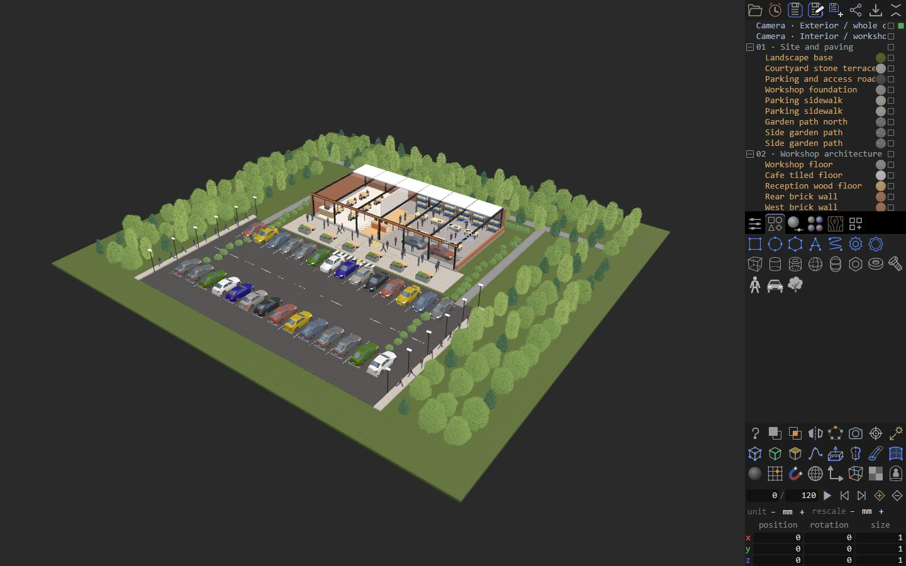

# Frame

A browser-based 3D workspace for spline and polygon modeling, scene assembly, and print-layer inspection.

**[Open Frame](https://mozg4d.github.io/frame/)** · [Task queue](https://mozg4d.github.io/frame/queue.html)

## Current application

The hosted application is **r233**. It provides parametric primitives, surface generators, Boolean operations, shared instances, materials, and animation. Native `.hash` files preserve editable scenes; geometry exchange supports glTF/GLB, OBJ, STL, PLY, SVG, and DXF.

The viewport requires a supported WebGPU configuration. Startup checks capabilities and offers Retry if initialization fails. Mip generation is selected through fresh numerical checks for each GPU generation, including odd-sized textures. Calibration failures expose a copyable diagnostic report. r229 reuses resources within one owner-bound calibration session while retaining the same validation controls. Startup timing still needs measurement on each target device. Cached application resources can be reopened offline through the PWA.

The slicer generates perimeter paths with guarded adaptive handling and Solid or Lines–Dots layer previews. Broader adaptive coverage and the practical print workflow remain unfinished. r230 accelerates exact Connected selection, refreshes coordinate-manager fields after Auto Local, and uses plain left-button camera navigation in 3D while retaining 2D marquee. r231 preserves natural double-click selection by waiting for 6 pixels of component drag before capturing geometry; small perspective left-button jitter no longer orbits the camera. Gizmo dimensions are unchanged. r232 adds GPU preview for eligible whole-island World Move/Rotate, with exact CPU authoring commits and sparse Undo/Redo. New logical contacts or changes to quantized vertex groups invalidate reuse. Local/Scale and other unsupported paths keep their existing CPU costs; selection revalidation can still make release slow. Native .hash loading preserves saved normals and indices. r233 also accelerates eligible whole-island Move in the default Object coordinate mode. Exact shared-edge connectivity allows safe reuse across internal quantization changes; near-only or unused aliases retain conservative validation. Object Rotate, Scale and nonuniform-owner cases retain their prior CPU behavior.

## Repository

- `index.html`, `modules/`, `frame-sw.js`, and `manifest.webmanifest`: the current application and PWA.
- `models/` and `textures/`: application assets.
- [editor-source/](editor-source/): current rigid-preview editor source, pinned rebuild and portable checks.
- [native-source/](native-source/): editable native viewport sources and their deterministic bundler.
- [development/gpu-v10/](development/gpu-v10/): unfinished GPU authoring work and reconstruction instructions.
- [development/slicer-lab/](development/slicer-lab/): unfinished slicer work and its development tools.
- [docs/NUMERIC_PRECISION.md](docs/NUMERIC_PRECISION.md): numeric storage and geometry rules.
- [queue.html](queue.html): open work and future ideas.
- [licenses/](licenses/): project and third-party licenses.

Development sources are separate from the current application's loaded modules. See each development directory's README for its status and checks.

## License

Frame's original code and project materials are proprietary. © 2026 FRAME copyright holders. All rights reserved; see [licenses/FRAME.txt](licenses/FRAME.txt). The official hosted application is free to use. Third-party components retain their own licenses. For embedding or integration, contact [mozg4d@gmail.com](mailto:mozg4d@gmail.com).
